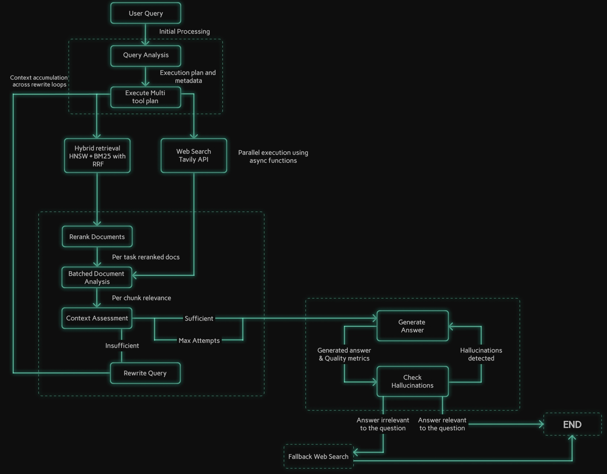

# Advanced Multi-Document Adaptive RAG Agent

## Table of Contents
- [Summary](#1-introduction)
- [Demo Video](#2-demo-video)
- [Performance & Architecture Highlights](#3-performance--architecture-highlights)
- [Architecture Diagram](#4-architecture-diagram)
- [Features](#5-features)
- [Tech Stack](#6-tech-stack)
- [Project Structure](#7-project-structure)
- [Installation](#8-how-to-run-the-app)
- [Challenges I Faced](#9-challenges-faced--solutions)
- [Future Improvements](#10-future-improvements)


## 1. Introduction

A full stack question-answering system designed to retrieve and synthesize information from multiple documents and real-time web sources, featuring intelligent query routing, self correcting retrieval loops, and multilayered quality validation to ensure factually grounded responses.

Built with **React.js**, **FastAPI**, and **LangGraph** orchestration, the system implements a hybrid search architecture combining **FAISS HNSW indexing** with **BM25 keyword search** with **RRF**, **cross-encoder reranking**, parallel multi-tool execution, and a dual-LLM strategy.

Key capabilities include adaptive query rewriting with gap analysis, metadata-aware document filtering, tool-aware hallucination detection, and relevance score caching.

## 2. Demo Video

<!-- Demo video will be added here -->
[*Demo video placeholder - to be added*](https://github.com/user-attachments/assets/7859d3ee-9384-4286-874b-9c673724d092)

## 3. Performance & Architecture Highlights

This agent was engineered for performance and reliability, achieving significant improvements through rigorous optimization and advanced architectural patterns.

### Performance Metrics:
*Validated through comprehensive evaluation framework with 27 metrics across answer quality, retrieval performance, and system intelligence.*

| Metric | Value | What It Measures |
|---|---|---|
| **Answer Relevance** | **91.7%** | Generated answers directly address the user's question and intent |
| **Faithfulness** | **92.3%** | Answers are grounded in retrieved context, preventing hallucinations |
| **Retrieval Recall@5** | **95%** | Most of the relevant information is found within the top-5 search results |
| **Query Success Rate** | **100%** | All queries complete successfully without errors or failures |
| **Intelligent Routing** | **93.3%** | Correct classification of queries into document-only, web-only, or hybrid search |
| **Reranking Effectiveness** | **85.9%** | Improvement in relevance ordering after applying cross-encoder reranking |
| **Self-Correction Rate** | **26.7%** | System autonomously detects and corrects potential answer quality issues |
| **Document Query Latency** | **10.8s** | Average response time for queries answered from uploaded documents |
| **Web Query Latency** | **10.9s** | Average response time for queries requiring real-time web search |
| **Hybrid Query Latency** | **24.5s** | Average response time for queries combining document and web sources |

**Evaluation Methodology:**
- **Answer Quality:** LLM-based evaluation (Groq) on 15 diverse queries spanning document-only, web-only, and hybrid scenarios
- **Retrieval Metrics:** Ground truth comparison using LLM-generated Q&A pairs, validated against actual retriever performance
- **System Intelligence:** Runtime tracking of routing decisions, self-correction triggers, and quality gate activations
- **Cost Efficiency:** $0.004 per full evaluation (27 metrics) — **95% cheaper than industry standard** ($0.08-0.15)

### Architectural Advancements

* **Hybrid LLM Strategy:** Deployed a dual-model setup using **Gemini 2.5 Flash** for reasoning and **Groq Llama3-8B** for evaluations, achieving a **35–40% reduction in latency** while maintaining high output quality.

* **Hybrid Search with Reciprocal Rank Fusion:** Combined **FAISS (semantic)** and **BM25 (keyword)** search with **RRF (k=60)** fusion, improving retrieval recall by **5–15%** for both factual and contextual queries.

* **FAISS HNSW Indexing:** Upgraded to **IndexHNSWFlat (M=32, efConstruction=40)** for **3–10x faster search** and logarithmic scaling, enabling real-time retrieval on large corpora.

* **Optimized Self-Correction Loop:** Rebuilt the self-correction system with **fast heuristic pre-checks**, **skip-reranking on retries**, and **context deduplication**, delivering a **3–4x speedup** while preserving adaptive RAG accuracy.

* **Parallel Multi-Tool Execution:** Integrated **ThreadPoolExecutor-based concurrency** for document retrieval and web search, significantly reducing latency for hybrid multi-source queries.

* **Relevance Score Caching:** Introduced **context-signature caching (MD5 hashing)** to reuse prior relevance evaluations, eliminating redundant LLM calls and saving several seconds per retry.

* **Advanced Few-Shot Prompting:** Employed **structured few-shot examples** across critical chain components (query analysis, context assessment, quality checks) to dramatically improve output consistency and reduce hallucination rates.

* **Persistent Data Management:** Implemented **persistent chunk and BM25 index storage**, ensuring reliable document addition/deletion and full recovery without index corruption.

## 4. Architecture Diagram




## 5. Features

### Core User Features

* **Multi-Format Document Upload:** Ingest knowledge from PDF, DOCX, TXT, CSV, and XLSX files.
* **Session Management:** Persistent document context and conversation history per user session.
* **Reliable Document Management:** Add or remove documents with automatic, efficient index rebuilding (FAISS + BM25).
* **Advanced Hybrid Search:** Dual-mode retrieval combining (1) **FAISS semantic search** for context understanding and (2) **BM25 keyword search** for exact term matching, fused with Reciprocal Rank Fusion (RRF) for optimal results.
* **Multi-Tool Execution:** Seamlessly blends information from uploaded documents and real-time web search results (via Tavily) based on intelligent query routing.
* **Complex Query Handling:** Understands and answers multi-part questions requiring information synthesis across sources.
* **Streaming Responses with Rich Formatting:** Answers appear token-by-token with full markdown support (bold, italic, lists, code blocks, tables) for enhanced readability.
* **Real-Time Quality Metrics:** Visual gauges display answer relevance and document grounding scores with detailed per-chunk analysis.
* **Source Grounding:** Clear indication of whether information comes from documents, web, or hybrid sources with evaluation reasoning.

### Advanced Pipeline Features

* **Intelligent Query Analysis Router:** Deconstructs user intent with **few-shot guided prompts**, identifies relevant source documents via metadata, and creates dynamic, multi-tool execution plans.
* **Metadata-Aware Multi-Tool Executor:** Executes plans precisely, applying source document filters to the FAISS vector store to prevent context contamination.
* **Optimized Self-Correcting Retrieval Loop (3-4x Faster):**
    * **Fast Heuristic Pre-Check:** Lightweight token/keyword analysis (saves 2-3s in 50-60% of queries) before expensive LLM assessment.
    * **Analytical Context Assessment:** Uses "Gap Analysis" prompt on Groq Llama3-8B to check if retrieved context *logically* covers all parts of the query (only when heuristic is uncertain).
    * **Smart Retry Strategy:** Skips reranking on retry attempts (saves 3-7s), accumulates context across attempts with deduplication.
    * **Targeted Query Rewriting:** If context is insufficient, rewrites the query focusing on *missing information* (informed by Gap Analysis) and retries retrieval (max 2 attempts).
* **Optimized Reranking:** Fast, GPU-accelerated cross-encoder (BAAI/bge-reranker-base) selects the most relevant context chunks.
* **Robust Quality Gates with Few-Shot Validation:**
    * **Tool-Aware Hallucination Check:** Validates generated answers against *all* context sources (docs + web) using **few-shot examples** to improve accuracy, correctly handling hybrid answers. Uses a fast LLM (Groq).
    * **Relevance Check:** Ensures the final answer directly addresses the original user question with **structured evaluation prompts**. Uses a fast LLM (Groq).
    * **Answer Regeneration:** Allows for limited retries if an answer fails quality checks.


## 6. Tech Stack

* **Frontend:** React.js, TypeScript, Vite, Tailwind CSS, Axios, React-Markdown (for rich text formatting)
* **Backend:** Python 3.11+, FastAPI, Uvicorn
* **AI Orchestration:** LangGraph
* **LLMs:**
    * Reasoning/Generation: Google Gemini 2.5 Flash (3-5x faster than Pro with minimal accuracy loss)
    * Evaluation/Checks: Groq API (Llama3-8B for fast context assessment and quality gates)
* **Vector Database:** FAISS (IndexHNSWFlat with persistent chunk store via Pickle)
* **AI/ML Components:**
    * Embeddings: `BAAI/bge-base-en-v1.5` (upgraded from all-mpnet-base-v2, GPU-optimized)
    * Reranking: `BAAI/bge-reranker-base` (Cross-Encoder with MPS acceleration)
    * Hybrid Search: `rank-bm25` (BM25 keyword search + RRF fusion)
    * Document Processing: `unstructured`, `pypdf`, `python-docx`
    * Web Search: Tavily API
* **Deployment:** Docker, Nginx (for frontend)

## 7. Project Structure
```
AdvLang/
├── frontend/                    # React TypeScript Frontend (Vite)
│   ├── src/
│   │   ├── components/          # UI Components
│   │   └── App.tsx
│   └── package.json
├── backend/                     # FastAPI Python Backend
│   ├── chains/                  # Core Logic Components (LangChain/Custom)
│   │   ├── query_analysis_router.py # Planning LLM Chain
│   │   ├── multi_tool_executor.py   # Tool Execution & Filtering Logic
│   │   ├── rerank_documents.py      # Cross-Encoder Reranking
│   │   ├── context_assessment_groq.py # Sufficiency Check (Groq/Fallback)
│   │   ├── rewrite_query.py         # Query Rewriting Logic
│   │   ├── generate_answer.py       # Generation LLM Chain
│   │   ├── evaluate_groq.py         # Doc Quality Check (Groq/Fallback)
│   │   └── relevance_groq.py        # Hallucination/Relevance Check (Groq/Fallback)
│   ├── api.py                   # FastAPI Endpoints & Streaming Logic
│   ├── rag_workflow.py          # LangGraph Workflow Definition
│   ├── document_processor.py    # Chunking, Indexing, Persistent Chunk Store
│   ├── document_loader.py       # Document Loading & Metadata Tagging
│   ├── session_manager.py       # Session Tracking & State
│   ├── state.py                 # LangGraph State Schema
│   ├── config.py                # API Keys & Settings
│   └── utils.py                 # Helper Functions
├── tests/                       # Unit & Integration Tests
│   ├── test_metadata_filtering.py
│   ├── test_query_rewriting.py
│   ├── test_hybrid_queries.py
│   ├── test_groq_integration.py
│   └── test_deletion_rebuild.py
├── faiss_indexes/               # Persistent FAISS Indexes & Chunk Stores
│   ├── chunk_stores/            # Pickled Chunk Data
│   └── bm25_indexes/            # BM25 Indexes for Hybrid Search
├── run_api.py                   # API Startup Script
├── requirements.txt             # Python Dependencies
└── .env                         # Environment Variables (API Keys)
```

## 8. How to Run the App

### Prerequisites
* Python 3.11+
* Node.js 18+
* An .env file with GOOGLE_API_KEY, TAVILY_API_KEY, and GROQ_API_KEY.

### Step 1: Clone & Setup
```bash
git clone <your-repo-link>
cd adaptive-rag-agent
```

### Step 2: Backend Setup
```bash
# Create and activate virtual environment
python -m venv venv
source venv/bin/activate  # On Windows: venv\Scripts\activate

# Install dependencies
pip install -r requirements.txt
```

### Step 3: Frontend Setup
```bash
cd frontend
npm install
```

### Step 4: Run the Application
```bash
# Terminal 1: Start the Backend Server (from project root)
python run_api.py

# Terminal 2: Start the Frontend Dev Server (from frontend folder)
cd frontend
npm run dev
```
Access the application at http://localhost:5173 (or your Vite port).

## 9. Challenges Faced & Solutions
This project navigated complex engineering challenges through iterative debugging and architectural refinement:

- **Problem:** Extreme Initial Latency (>56s) due to N+1 LLM calls for document grading.  
  **Solution:** Replaced grading with fast, local GPU-accelerated cross-encoder reranking and batch analysis, cutting evaluation time drastically.

- **Problem:** Self-correction loop too slow (20–30s overhead) making the feature unusable.  
  **Solution:** Re-engineered with (1) Fast heuristic pre-checks, (2) Skip reranking on retry attempts, and (3) Context accumulation with deduplication—achieving **3–4x faster adaptive correction**.

- **Problem:** High latency in evaluation steps (Context Assessment, Quality Checks).  
  **Solution:** Implemented a **Hybrid LLM strategy** using Gemini 2.5 Flash for reasoning and Groq Llama3-8B and Qwen3-32B for evaluations, achieving **~35–40% lower latency**.

- **Problem:** Semantic search missing keyword-specific queries (IDs, codes, names).  
  **Solution:** Built **Hybrid FAISS + BM25 search** with Reciprocal Rank Fusion (RRF), boosting retrieval recall by **5–15%**.

- **Problem:** Slow FAISS search with large document collections (O(n) complexity).  
  **Solution:** Migrated to **HNSW indexing (IndexHNSWFlat, M=32, ef=40)** for **3–10x faster retrieval** at O(log n) complexity.

## 10. Future Improvements
* Advanced Retrieval Strategies: Explore HyDE or Multi-Query Retrieval to further enhance initial retrieval relevance, potentially reducing the need for query rewriting.
* More Specialized Tools: Integrate tools like calculators, code interpreters, or database agents for broader query capabilities.
* UI/UX Enhancements: Add interactive citation highlighting (linking answer snippets to source chunks) and allow user feedback on answer quality.
* Formal Evaluation Suite: Develop a comprehensive evaluation dataset using frameworks like RAGAs or DeepEval to continuously monitor and quantify performance metrics (faithfulness, context relevance, answer relevance).
* Alternative Vector Stores: Experiment with other vector stores like LanceDB or ChromaDB for potential performance or feature benefits.
